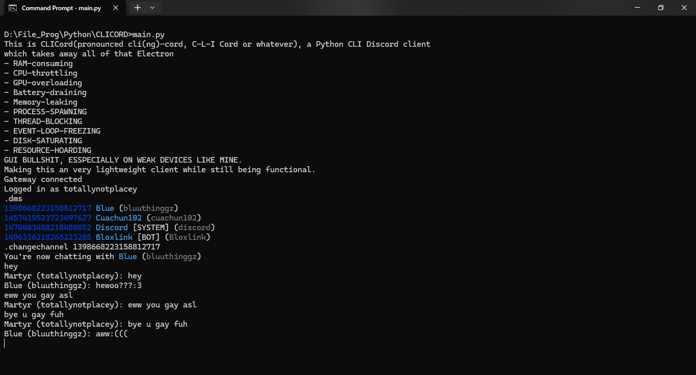

# CLICord

CLICord(pronounced cli(ng)-cord) is a lightweight terminal-based Discord client written in Python.

Instead of launching an entire Chromium-powered apartment complex just to send messages, CLICord runs directly in your terminal with minimal resource usage.

## Features

- Lightweight terminal interface
- Realtime Gateway connection
- Message sending and receiving
- Friend list fetching
- DM listing
- Status changing
- Session resume support

## Preview


---

# Setup

## 1. Install dependencies

```bash
pip install -r requirements.txt
```

## 2. Create `.env`

Create a `.env` file in the project root:

```env
TOKEN=your_discord_token_here
```

Don't know how to get your discord token? just.. search google i guess, beware of scams tho

## 3. Run

```bash
python main.py
```

---

# Usage

Messages typed normally are sent to the currently selected channel.

Commands start with a dot (`.`).

Example:

```text
.changechannel 123456789012345678
yo wsg ma babies
```

The message `yo wsg ma babies` will be sent to channel `123456789012345678`.

---

# Commands

`.help`

Displays the command list.

---

`.friends`

Fetches and displays your friends list.

---

`.dms`

Lists available DMs and Group DMs.

Use the printed channel IDs with `.changechannel`.

---

`.changechannel <id>`

Selects a channel for chatting.

After selecting a channel, normal text input will send messages there.

---

`.send <message>`

Sends a message to the currently selected channel.

Useful when the message itself starts with a dot.

---

`.status <status> <activities included?>`

Changes your Discord status.

Available statuses typically include:

- `online`
- `idle`
- `dnd`
- `invisible`

Optionally, there's `<activities included?>` which if True will load activities from activities.json

Example:

```text
.status dnd True
```

---

`.info`

Displays basic account information including ID, user/display name.

---
# Notes

- Group DMs are supported.
- Terminal ANSI color support is required.
- Unicode output is enabled automatically on Windows.

---

# Disclaimer

This project uses Discord's API directly and may violate Discord's Terms of Service depending on how it is used.

And i don't care if you get banned by using this.

---

# yes i asked chatgpt to generate this readme